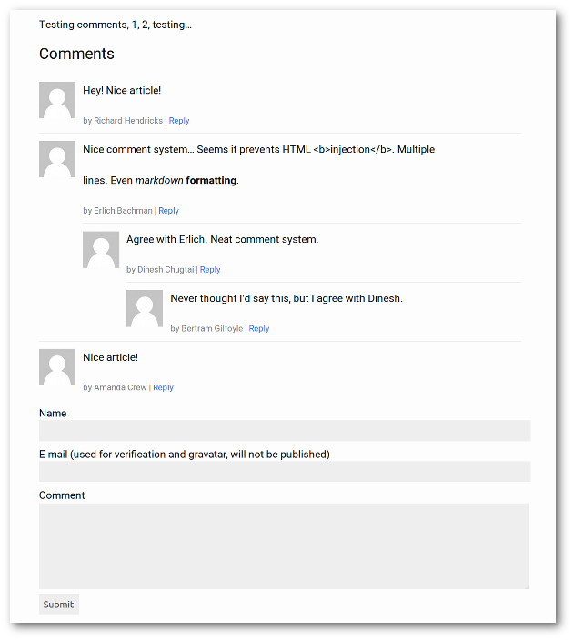

Dead Simple Jekyll Comments
===========================
DIY comment system for Jekyll

- Works on any repo (Github, Bitbucket, ...) including private ones
- No need to trust a third party
- No JavaScript
- No SQL
- No PHP
- No Ruby
- Only Liquid and one shell script
- Supports threaded conversations

How it works
------------
- Each comment is stored as a yaml file in `_data/comments`
- Comments are rendered with Liquid
- A static HTML form is included in each article
- Form submissions are intercepted by [`webhook`](https://github.com/adnanh/webhook) and processed by a bash script
- This bash script creates a comment file in a separate branch
- Comment is reviewed and merged into master

Detailed Instructions
---------------------
Outline:

0. Install prerequisits
1. Create a few sample comment files
2. Render these comments + a HTML comment form
3. Create the `add-comment.sh` script
4. Create a `hooks.yaml` configuration file
5. Launch webhook and test the whole thing

### Install prerequisits
On Ubuntu:

    # apt install yq webhook passwd

### Sample comment files
The file name should be `<comment id>.yaml` where the comment id is on the format `<unix timestamp>-<random identifier>`.

**Example:** `1516695540-quRch1Gi.yaml`

The format is carefully chosen: The timestamp makes it easy to show the comments in chronological order, and the random suffix avoids collisions when two comments are submitted the same second **and** makes the comment id unguessable, should you decide to have some approve/reject moderation link. Each comment lives in a separate file to avoid merge conflicts.

The comment file format looks like follows:

    reply_to: /some-post.html
    author: John Doe
    email: john.doe@gmail.com
    text: Nice article!

The above example illustrates be a top level comment on `/some-post.html`. Had it been a reply to another comment, it would have looked something like

    reply_to: 1516695540-quRch1Gi
    ...

Download and unzip [`sample-comments.zip`](https://github.com/aioobe/dead-simple-jekyll-comments/raw/master/sample-comments.zip) and put these files in `_data/comments`.

### Render comments + a comment HTML form
Download the following files:

- [`test-page.md`](https://github.com/aioobe/dead-simple-jekyll-comments/raw/master/test-page.md), save in the root of your site

  The interesting part is at the bottom:

      ...
    
      Comments
      --------
      
      

- [`comments.html`](comments.html), save it in `/_includes`

  This file displays a comment tree. The `replies_to` parameter should be `page.url`. Internally it includes itself recursively to render conversation trees. The `replies_to` parameter then refers to the parent comment.

- [`comment-form.html`](comment-form.html), save it in `/_includes`

  A simple comment form.

Build the site and open the resulting `test-page.html`. You should see something like this:

### Create a script for adding comments
Download the [`add-comment.sh`](add-comment.sh) bash script. Place it in a new directory called `comments-server` outside your repository.

The script needs a local copy of your repository, so, from within `comments-server/`, issue the following clone command:

    git clone --bare <YOUR REPO URL.git> repo

You can now try out `add-comment.sh`. The usage is

    ./add-comment.sh <reply_to> <author> <email> <text>

The script does the following:

1. Makes sure the local copy of the repo is up to date
2. Clones a teporary working copy
2. Creates a branch off of master
3. Writes the arguments to a yaml file according to the comment file format
4. Commits and pushes
5. Removes the working copy of the repo

The reason for creating a temporary copy of the repository is to allow multiple concurrent comment submissions. An alternative approach is to invoke `add-comment.sh` through [`tsp`](http://vicerveza.homeunix.net/~viric/soft/ts/) which enqueues commands and runs them in sequence.

The script uses [`yq`](https://github.com/mikefarah/yq) for writing yaml files to simplify handling of multiline strings.

### Create a webhook configuration file
Download [`hooks.yaml`](hooks.yaml) and place it in the `comments-server` directory.

This configuration says that requests to `<domain>:9000/hooks/add-comment` should trigger `add-comment.sh`.

### Launch webhook and test
Launch `webhook`:

    $ webhook -verbose -hooks hooks.yaml

Go to `<site url>/test-page.html` and try to submit a comment. Make sure a new branch is created with the comment. Merge the branch, rebuild your site and refresh the page.

Additional Features
-------------------

### Comment Count
The file [`count-comments.html`](count-comments.html) counts the number of comments in a comment thread and stores the result in a variable called `comment_count`. Put it in `_includes` and use it as follows:

    
    <h2>Comments ({{- comment_count -}})</h2>

or, a more elaborate version:

    
    
    <h2>Comments ({{ comment_count }})</h2>
    
    <h3>Add comment</h3>
    
    <h2>Comments</h2>
    Be the first to comment!
    
    

### Email features
`ssmtp` is trivial to configure and allows you to...
- Notify you about new comments
- This email can contain links to other webhooks that
  - accepts the comment (merges into master)
  - rejects the comment (deletes the branch)
- Verify the users email by:
  - First putting the comment file in an "unverified" directory
  - Send an email to the provided email address with a link to a webhook
  - The webhook triggers a script that creates a branch, moves comment file to the data directory and commits / pushes.
- If you have a CI system that builds all branches, you can include a link to the comment branch to easily review how the comment looks rendered.
